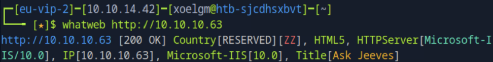
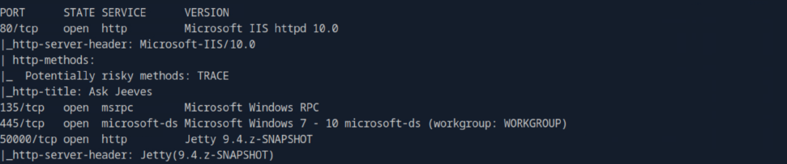
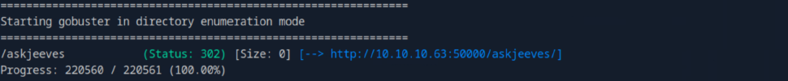

# 🧰 Hack The Box — Jeeves

- **IP:** 10.10.10.63
- **Nivel:** Medio  
- **Sistema operativo:** Windows  
- **Categoría:** Web, Escalada de Privilegios  
- **Flag user:** ✅  
- **Flag root:** ✅  

---

## 🧾 Información general

Jeeves es una máquina Windows de dificultad media en Hack The Box que simula un entorno empresarial con una instancia Jenkins expuesta sin autenticación. La explotación combinó ejecución remota de comandos mediante la consola Groovy, extracción de contraseñas desde una base de datos KeePass, y escalada de privilegios a SYSTEM usando JuicyPotato y Alternate Data Streams (ADS) de NTFS.

---

## 🔍 Fase 1: Reconocimiento

### WhatWeb

```bash
whatweb http://10.10.10.63
```



#### Resultados:
- El servidor web está corriendo **Microsoft IIS 10.0**.

---

## 🚪 Fase 2: Escaneo y enumeración

### Escaneo de puertos con Nmap

```bash
nmap -sS -p- --min-rate=5000 -n -Pn 10.10.10.63
```

#### Parámetros:
- `-sS`: Escaneo SYN (rápido y sigiloso).
- `-p-`: Escanea todos los puertos (1 al 65535).
- `--min-rate=5000`: Aumenta la velocidad del escaneo.
- `-n`: No resuelve DNS.
- `-Pn`: Omite el ping previo al escaneo.


  
#### Resultado:
- Puertos abiertos: **80**, **135**, **445**, **50000**.

### Escaneo detallado con Nmap

```bash
nmap -sC -sV -p80,135,445,50000 10.10.10.63
```

#### Parámetros:
- `-sC`: Usa los scripts predeterminados de Nmap.
- `-sV`: Detecta versiones de servicios.
  

  
#### Resultado:
- Puerto **80** → IIS 10.0 con el título “Ask Jeeves”.
- Puerto **135** → Microsoft Windows RPC.
- Puerto **445** → Servicio SMB (Microsoft-DS).
- Puerto **50000** → Jetty 9.4.z-SNAPSHOT, responde con un error 404.

### Escaneo con Gobuster

```bash
gobuster dir -u http://10.10.10.63:50000 -w /usr/share/wordlists/dirbuster/directory-list-2.3-medium.txt
```

#### Parámetros:
- `dir`: Modo directorios.
- `-u`: URL objetivo.
- `-w`: Wordlist utilizada.



#### Resultado:
- Ruta encontrada: `/askjeeves` → Jenkins expuesto sin autenticación

---

## 💥 Fase 3: Explotación

Continuará...
